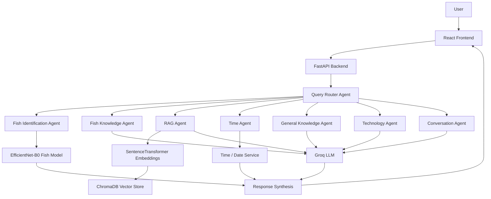

# FishAI Agentic RAG

FishAI is an AI-powered agentic RAG chatbot built for fish species identification, fish knowledge, document-based question answering, and general assistant tasks. The project combines a React frontend, a FastAPI backend, a custom query router, a fish classifier, and a document retrieval pipeline to answer user questions in a conversational interface.

## Project Objective

This project explores how multiple AI components can be combined into a single assistant for fish-related tasks. In its current form, FishAI supports:

- fish species identification from uploaded images,
- factual fish and aquaculture assistance,
- question answering over uploaded PDF, DOCX, and TXT documents,
- general knowledge and programming/technology Q&A,
- time and date queries,
- and a web-based chat experience with recent chat history and browser voice input.

The system is intended as a practical AI prototype and research project, not as a replacement for professional fisheries expertise or domain-certified biological assessment.

## Problem Statement
Fish-related information is often scattered across different sources such as research documents, websites, databases, and identification guides. Identifying fish species from images can also be difficult for students, researchers, fishermen, and other users without specialized fisheries knowledge.

Existing approaches may require users to use separate tools for fish identification, document-based information retrieval, and general question answering. General-purpose chatbots may also lack access to the user's specific fisheries documents.

FishAI addresses this problem by integrating **agentic AI, Retrieval-Augmented Generation (RAG), computer vision, and conversational AI** into a single platform for fish identification and fish-related information retrieval.

## Features

The current implementation includes the following features:

- Agentic query routing between specialized handlers
- Fish species identification using an EfficientNet-B0 model
- Fish knowledge responses for biology, fisheries, and aquaculture questions
- Retrieval-Augmented Generation (RAG) using uploaded documents
- PDF, DOCX, and TXT document processing
- ChromaDB vector storage for document retrieval
- Sentence-transformer embeddings for semantic search
- Image upload and prediction workflow
- Chat history and recent chats in the browser
- Voice input support in supported browsers
- Time and date queries
- React frontend with FastAPI backend
- Groq-powered LLM responses for general and domain-specific chat

## Architecture

The application is organized as a classic multi-layer AI assistant:

```text
User
  -> React Frontend
  -> FastAPI API
  -> Query Router Agent
  -> Specialized Agent
  -> Fish Model / RAG / LLM / Time Service
  -> Response Synthesis
  -> User
```



### Routing categories in the current implementation

The router currently evaluates user input and selects one of the following routes:

- `FISH_IDENTIFICATION`
- `FISH_INFORMATION`
- `DOCUMENT_QUERY`
- `TIME_QUERY`
- `PROGRAMMING_OR_TECHNOLOGY`
- `CONVERSATION`
- `GENERAL_KNOWLEDGE`

The dispatcher also includes an `IMAGE_ANALYSIS` label for the image-analysis agent, but the active route logic in the project primarily routes image-based queries through the fish-identification workflow.

## Technology Stack

### Backend

- Python
- FastAPI
- PyTorch
- torchvision
- EfficientNet-B0
- ChromaDB
- sentence-transformers
- Groq
- python-dotenv
- pypdf
- python-docx
- python-multipart

### Frontend

- React
- Vite
- Tailwind CSS
- React Markdown
- Framer Motion
- Lucide React

> Note: the current repository does not contain a LangGraph orchestration layer; the project uses direct Python routing and dispatch logic rather than a dedicated LangGraph workflow.

## Project Structure

```text
fish-ai-agentic-rag/
├── backend/
│   ├── app/
│   │   ├── agents/
│   │   │   ├── dispatcher.py
│   │   │   ├── fish_agent.py
│   │   │   ├── fish_identification_agent.py
│   │   │   ├── rag_agent.py
│   │   │   └── time_agent.py
│   │   ├── api/
│   │   │   ├── chat.py
│   │   │   ├── documents.py
│   │   │   └── fish_prediction.py
│   │   ├── rag/
│   │   │   ├── chunker.py
│   │   │   ├── document_loader.py
│   │   │   ├── embeddings.py
│   │   │   ├── retriever.py
│   │   │   └── vector_store.py
│   │   ├── ai_service.py
│   │   ├── fish_model_service.py
│   │   ├── main.py
│   │   └── router_agent.py
│   ├── data/
│   ├── models/
│   │   ├── class_names.json
│   │   ├── fish_efficientnet_b0_best_phase2.pth
│   │   └── model_info.json
│   ├── uploads/
│   ├── .env.example
│   ├── requirements.txt
│   └── ...
├── frontend/
│   ├── src/
│   ├── package.json
│   ├── vite.config.js
│   └── ...
├── .gitignore
├── README.md
└── ...
```

## Requirements

Before running the project locally, make sure the following are installed:

- Python 3.10+
- Node.js 18+ or a current LTS version
- npm
- Git
- A valid Groq API key

## Installation and Setup

### 1. Clone the repository

```bash
git clone https://github.com/mgozirafael414-eng/fish-ai-agentic-rag.git
cd fish-ai-agentic-rag
```

### 2. Backend setup

```bash
cd backend
python -m venv venv
```

For Windows PowerShell:

```powershell
.\venv\Scripts\Activate.ps1
```

Then install dependencies:

```bash
python -m pip install --upgrade pip
python -m pip install -r requirements.txt
```

Create a local environment file from the example:

```bash
Copy-Item .env.example .env
```

Then update `.env` with your Groq key and optional model selection.

Start the backend:

```bash
uvicorn app.main:app --reload --host 0.0.0.0 --port 8000
```

The API documentation is available at:

```text
http://127.0.0.1:8000/docs
```

### 3. Frontend setup

```bash
cd ../frontend
npm install
npm run dev
```

The React app runs on the Vite default development URL:

```text
http://localhost:5173
```

## Environment Variables

The backend reads configuration from environment variables. The actual variable name currently used by the code is:

- `GROQ_API_KEY`
- `GROQ_MODEL` (optional; defaults to `openai/gpt-oss-120b`)

A secure template file is included at `backend/.env.example`.

## API Documentation

The backend exposes the following routes in the current implementation.

| Endpoint | Method | Purpose |
| --- | --- | --- |
| `/` | GET | Root API status endpoint |
| `/health` | GET | Backend health check |
| `/api/chat` | POST | Send a chat message and route it to the relevant agent |
| `/api/chat/image` | POST | Upload an image for fish identification |
| `/api/fish/predict` | POST | Predict the fish species from an uploaded fish image |
| `/api/documents/upload` | POST | Upload a PDF, DOCX, or TXT document |
| `/api/documents/` | GET | List uploaded documents and stored chunk counts |
| `/api/documents/{filename}` | DELETE | Delete a specific uploaded document |

### `/api/chat`

Request body:

```json
{
  "message": "What fish species is this?",
  "conversation": [
    { "role": "user", "content": "Hello" },
    { "role": "assistant", "content": "Hi! How can I help?" }
  ]
}
```

Response:

```json
{
  "success": true,
  "response": "...",
  "route": "FISH_IDENTIFICATION",
  "agent": "Fish Identification Agent"
}
```

### `/api/chat/image`

- Accepts an uploaded image file.
- Supported content types: JPG, PNG, WEBP.
- The uploaded image is saved and sent to the fish identification agent.
- Returns a success payload containing the saved filename and generated AI response.

### `/api/fish/predict`

- Accepts a fish image upload.
- Supported formats: JPG, JPEG, PNG, WEBP, BMP.
- Returns the predicted species, confidence, confidence category, and top predictions.

### `/api/documents/upload`

- Accepts a PDF, DOCX, or TXT file.
- Validates file type and document readability.
- Extracts text, chunks it, and stores it in ChromaDB.
- Returns metadata including the filename and number of stored chunks.

### `/api/documents/`

- Lists uploaded document sources and chunk counts.

### `/api/documents/{filename}`

- Deletes an uploaded file and removes the corresponding document chunks from the vector store.

## Model Information

The fish-classification model used by this project is:

- Model: EfficientNet-B0
- Task: fish species classification
- Classes: 484
- Input size: 224 x 224
- Framework: PyTorch
- Checkpoint: `backend/models/fish_efficientnet_b0_best_phase2.pth`

The project metadata reports the following evaluation metrics:

- Validation accuracy: 85.90%
- Test accuracy: 84.92%
- Macro precision: 79.87%
- Macro recall: 80.47%
- Macro F1: 78.78%
- Weighted precision: 84.59%
- Weighted recall: 84.92%
- Weighted F1: 83.29%

Confidence bands implemented by the model service are:

- HIGH: >= 70%
- MODERATE: 40% to 69.99%
- LOW: < 40%

### Important limitation

The current classifier is a closed-set fish classifier. It is trained on a fixed set of known fish classes and does not explicitly provide a dedicated non-fish detection step. As a result, a non-fish image may still be assigned to one of the known fish classes if the model sees it as visually similar.

## Screenshots

This repository does not currently include production screenshots for the app UI or model outputs. The project is ready for image-based documentation, and screenshots can be added later in a dedicated folder such as `docs/screenshots/` or in the repository root when available.

## Known Limitations

- The fish model is a closed-set classifier and is not a general-purpose fish-versus-non-fish detector.
- Similar-looking species may produce confused predictions.
- Model confidence is a probability-based indicator and does not guarantee correctness.
- The system depends on a valid Groq API key for LLM generation.
- RAG quality depends on the quality and relevance of uploaded documents.
- Local development requires both the backend and frontend services to be running.

## Future Improvements

The following are realistic future improvements for the project:

- Fish vs. non-fish detection
- Out-of-distribution detection for unknown fish and non-fish inputs
- Better confidence calibration
- Expansion to more fish classes and wider species coverage
- Better dataset quality and annotation improvements
- Cloud deployment with managed hosting and secrets management
- Authentication and user accounts
- Persistent cloud vector database
- Improved multimodal reasoning
- Mobile-friendly interface or mobile application
- More comprehensive evaluation and benchmarking

## Deployment

### Local development

The project is designed to run locally with:

- Python backend on port 8000
- React frontend on port 5173

### Production deployment

A production deployment would require:

- a backend host (for example, a Python hosting service or container platform),
- a frontend static host or Node-based deployment,
- environment variables configured via the platform's secret-management system,
- secure CORS and HTTPS settings,
- access to the trained model file,
- persistent vector storage if the document database should remain available across deployments,
- and secure handling of the Groq API key.

The Groq key must never be committed to the repository and should be supplied only through deployment secrets or environment variables.

## Security

- API keys are stored as environment variables.
- `.env` files must never be committed to Git.
- `.env.example` contains placeholders only.
- Secret values must remain server-side.
- User uploads and generated vector data should not be committed unless intentionally required.
- Deployment secrets should be managed through the hosting platform's environment or secret store.

## License and Usage

This project is intended for academic, portfolio, and research demonstration use. The repository should be reviewed and used in accordance with the project owner’s licensing and data constraints before public deployment or commercial use.

## Final Notes

FishAI is a practical demo of an agentic AI pipeline for fish identification and knowledge retrieval. It combines computer vision, vector search, document ingestion, and LLM-based conversational responses in a single application, while keeping the current implementation and limitations honest and transparent.
